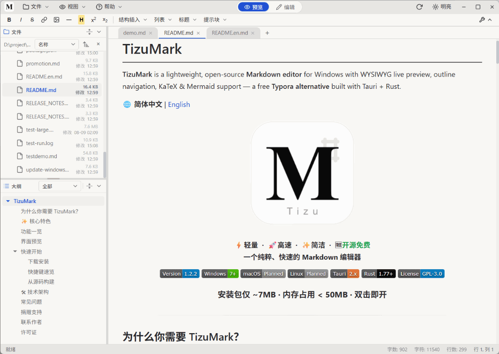

# TizuMark

一个轻量的 Markdown 编辑器（Windows），基于 Tauri + 原生 JavaScript，纯本地运行。



## 特性

- Markdown 编辑 + 实时预览（CodeMirror 编辑器 + unified / remark / rehype 渲染管线）
- 图表与公式：Mermaid、ECharts、WaveDrom、Graphviz、TikZ、函数绘图、思维导图（Markmap）、KaTeX 数学公式
- 图片与文件：粘贴 / 拖拽插图、图片查看器、文件树工作区、外部改动自动刷新
- 导出：HTML / PDF / Word（DOCX，真 OOXML）；长图 PNG 仍保留但已从菜单隐藏
- 大纲导航、多标签、查找替换、多主题与配色、快捷键自定义、中英文界面
- 完全离线，不联网、不收集数据

## 下载

从 [Releases](https://github.com/xccfcpd/mdplus/releases/latest) 下载 Windows x64 安装包（安装版 / 绿色便携版）。

## 本地开发

```bash
npm install
npm run dev      # 开发模式
npm run build    # 打包（需 Rust + Tauri 环境）
npm test         # 运行测试
```

## 版权与许可

Copyright (c) 2024-2026 TizuMark。保留所有权利。未经版权所有者许可，不得复制、修改或再分发本软件。

本软件包含按各自开源许可证（MIT、BSD-3-Clause、Apache-2.0 等）分发的第三方组件，详见软件内「帮助 → 关于」。
